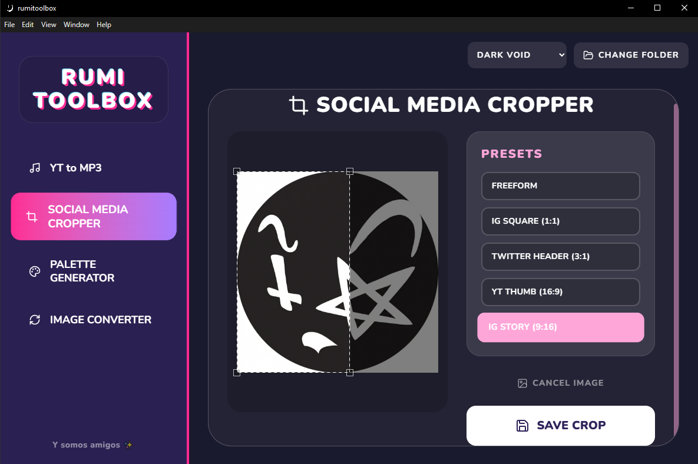

# 🎨 Artist ToolBox



Artist ToolBox is a multi-purpose desktop application built with **Electron, React, and Vite**. It is designed as an all-in-one toolbox to streamline digital content creation, featuring a sleek, dark-themed responsive interface.

##  Features

- ** Social Media Cropper**: Easily upload and crop images to perfect aspect ratios for various platforms (Instagram Square/Story, Twitter headers, etc.).
- ** Palette Generator**: Extract or generate beautiful color palettes to use in your art.
- ** Image Converter**: Instantly convert images between formats efficiently.
- ** YT to MP3**: Quickly download and convert YouTube links into MP3 audio!

##  Tech Stack

- **Electron **: Bringing web technologies to native desktop.
- * *React **: Powerful, component-based UI development.
- ** Vite **: Ultra-fast build tool and development server.
-  ** CSS3 **: Custom, modern dark-mode styling with glassmorphism touches.

##  Running Locally

1. Clone this repository:
   ```bash
   git clone https://github.com/aurarian-sawa/artist-toolbox.git
   ```
2. Navigate to the project folder and install dependencies:
   ```bash
   cd artist-toolbox
   npm install
   ```
3. Start the development server:
   ```bash
   npm run dev
   ```
4. To build the desktop executable (`.exe`), run:
   ```bash
   npm run build
   ```

---
*Created by [aurarian-sawa](https://github.com/aurarian-sawa) ✨*
